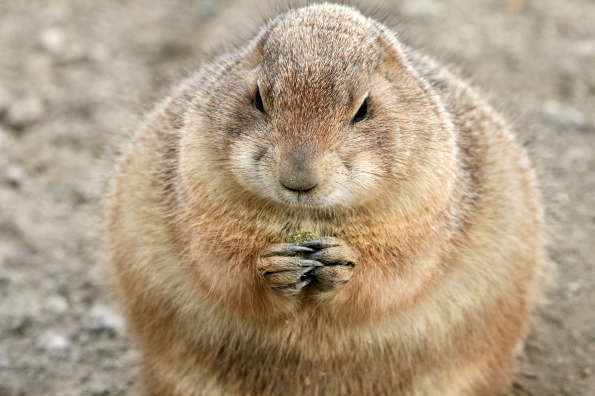

# go-micrograd



This is a Go implementation of Andre Karpathy's micrograd library. Implements backpropagation (reverse-mode autodiff) over a dynamically built DAG and a small neural networks library on top of it with a PyTorch-like API (as close as you can get to it in Go). Both are tiny, with about 100-200 lines of code each. The DAG only operates over scalar values, so e.g. we chop up each neuron into all of its individual tiny adds and multiplies. However, this is enough to build up entire deep neural nets doing binary classification, as the `main.go` file shows. Potentially useful for educational purposes.

### Example usage
```go
package main

import "github.com/nathan-barry/go-micrograd"

func main() {
    // inputs x1, x2
    x1 := New(2.0)
    x2 := New(0.0)

    // weights w1, w2
    w1 := New(-3.0)
    w2 := New(1.0)

    // bias
    b := New(6.8813735870195432)

    // x1*w1 + x2*w2 + b
    w1x1 := Mul(w1, x1)
    w2x2 := Mul(w2, x2)
    w1x1w2x2 := Add(w1x1, w2x2)
    n := Add(w1x1w2x2, b)

    // activation function
    o := Tanh(n)

    // backward pass
    o.Backward()

    // display computation graph
    o.DisplayGraph()
}
```

### Training a neural net

The `main.go` file has various examples training a neural network, specifically `func example3()`. Add this into `main()` to run the example.

### License

MIT
